Draft
================

# **Introduction**

The data are from the Fluox, and are already processed for the clear sky
days, also the database are filtered for the DOY&gt;=128, the bellow
code was apply to be abble of uploading this data to github because the
size of the first file was larger than 100Mb:

The time serie consist in observations on Alfafa crop during DOY 144 and
193

``` r
# 
#namefile <- list.files("data-raw/spectra/", pattern="JB-009-ESA_F")
# 
# ori_tab <- readr::read_csv(paste0("data-raw/spectra/",namefile),col_names = TRUE)
# col_Names <- as.character(ori_tab$F_final1)
# 
# trans_tab <- t(ori_tab)
# colnames(trans_tab) <- col_Names
# trans_tab <- as.data.frame(trans_tab)
# 
# trans_tab <- trans_tab[-1, ]
# trans_tab <- trans_tab[,-2]
# colnames(trans_tab)[1] <- "DOY"
# 
# trans_tab <- trans_tab |>
#   dplyr::filter(
#     DOY > 127.9
#   )
# namefile_rds <- sub(".csv",".rds",namefile)
# readr::write_rds(trans_tab, paste0("data/",namefile_rds))
```

Now we are keeping going from here with the `.rds` file

``` r
namefile <- list.files("data-raw/", pattern = "_F_")
ori_tab <- readr::read_rds(paste0("data-raw/",namefile))
names(ori_tab) <- c("DOY",
               round(
                 as.numeric(names(ori_tab)[2:length(ori_tab)]), 2)
)
```

Reading the Index file

``` r
ind_file <- readr::read_csv("data-raw/table_all_index.csv") |>
  dplyr::filter(DOYdayfrac > 127.9)
```

# **Processing**

First we are gonna make the time table and made a mean for every 30 m

``` r
time_table <- cbind(ind_file,ori_tab)
time_table <- time_table |> 
  dplyr::filter(DOY >= 144 & DOY <=193)


time_table <- time_table |>
  dplyr::filter(lubridate::hour(time_table$UTC_datetime) > 8)

min_int<-"30 min" #step 
sttime <- time_table$UTC_datetime[1] # start time of the serie
endtime <- time_table$UTC_datetime[8344] #final time of the serie


## Making the agreggation

timetoagg<-seq.POSIXt(from = as.POSIXct(sttime,tz = "UTC"),
                      to = as.POSIXct(endtime,tz = "UTC"),
                      by = min_int)

time_agg <- aggregate(x = time_table,
                      by = list(cut(as.POSIXct(time_table$UTC_datetime,tz = "UTC"),
                                    timetoagg)), FUN = mean)
```

Now we need to load the GPP data and find the days and hours that bolth
have measurments

``` r
gppFile <- list.files("data-raw/", pattern = "aa_")
gpp_table <- readr::read_csv(paste0("data-raw/", gppFile))
```

If we try to use the function `dplyr::semi_join()` we are not gonna get
any result, because the data frames don’t have any column to compare, so
we must create in this case

``` r
time_agg <- time_agg |> dplyr::mutate(day = time_agg$DOY%/%1,
                                      Hr1 = lubridate::hour(as.character(Group.1)),
                                      Mn1 = lubridate::minute(as.character(Group.1)))

time_agg <- time_agg[,-7] # this line is because they have the same same in the GPP table, but with no match 

gpp_table <- gpp_table |> dplyr::mutate(day=DOY%/%1)

# Now we can use the semi_join

comp_f_gpp <- dplyr::semi_join(time_agg,gpp_table)
comp_gpp_f <- dplyr::semi_join(gpp_table,time_agg)
comp_gpp_f <- comp_gpp_f[,-c(6,176)]

df_final <- cbind(comp_f_gpp,comp_gpp_f)
```

Now we are gonna do a integral in the F spectra, but first we have to do
some transformations in the `time_agg`.

``` r
spectra_Table <- time_agg[,-c(689:691)]
spectra_Table <- as.data.frame(t(spectra_Table))
c_spectra <- paste0(lubridate::hour(as.character(spectra_Table[1,])),":",
                                    lubridate::minute(as.character(spectra_Table[1, ])))
colnames(spectra_Table) <- c_spectra
spectra_Table <- spectra_Table[-c(1:6), ]
rownames(spectra_Table) <- seq(1:682)
spectra <- names(ori_tab[0, c(2:683)])
spectra_Table <- cbind(spectra,spectra_Table)
colnames(spectra_Table) <- make.unique(names(spectra_Table))
spectra_Table[,1] <-as.numeric(spectra_Table[,1])
```

Integrating function:

``` r
integral <- function(x,y){
  approxfun(x,y)
}

result <- vector("list", length = ncol(spectra_Table))

for (i in 1:(ncol(spectra_Table))){
  int <- integral(spectra_Table$spectra, spectra_Table[,i])
  result[[i]] <- integrate(int, min(spectra_Table$spectra),
                           max(spectra_Table$spectra))
}

for(i in 1:length(result)){
  if(i==1){
    fint <- result[[i]]$value
  }else{
    fint_a <- result[[i]]$value
    fint <- rbind(fint,fint_a)
    fint <- as.data.frame(fint)
  }
}

row.names(fint) <- seq(1:208)
fint <- as.data.frame(fint[-1,]) # the first observasation is the integral of wavelenght in function of it self

colnames(fint) <- "Fint"

## Now we are gonna add the integral in the final dataset

df_final <- cbind(df_final,fint)
```

Before going plot the data, first we need another transformations to do
a correlation plot for all the Fluoresce spectra

``` r
fint_t <- vector("numeric", length = 208)
fint_t[2:208] <- t(fint)

spectra_Table[683, ] <- fint_t
gpp <- vector("numeric", length = 208)
gpp[2:208] <- comp_gpp_f$GPP_DT_U95
spectra_Table[684, ] <- gpp

for(i in 2:ncol(spectra_Table)){
  if(i==2){
    tab <- as.numeric(spectra_Table[,i])
  }else{
    tab_a <- as.numeric(spectra_Table[,i])
    tab <- cbind(tab,tab_a)
    }
}
tab <- as.data.frame(tab)
colnames(tab) <- comp_gpp_f$TIMESTAMP
tab <- as.data.frame(t(tab))
colnames(tab) <- spectra_Table$spectra
colnames(tab)[683] <- "fint"
colnames(tab)[684] <- "gpp"

## 

pear_resul <- vector("list", length = ncol(tab))
for(i in 1:length(pear_resul)){
  pear_resul[[i]] <- cor.test(tab$gpp, tab[,i])
}

for(i in 1:length(pear_resul)){
  if(i==1){
    correl <- pear_resul[[i]]$estimate
  }else{
    correl_a <- pear_resul[[i]]$estimate
    correl <- rbind(correl,correl_a)
    correl <- as.data.frame(correl)
  }
}

rownames(correl) <- colnames(tab)
correl[,2] <- spectra_Table$spectra
```

# **Plots**

## **Correlations plots**

### **Corellation for the whole spectra**

Ploting correlation in the Fluoresce spectra, without F integral.
`F integral r = 0.65`

``` r
correl[-c(683:684),] |>
  ggplot2::ggplot(ggplot2::aes(x=as.numeric(V2), y = cor))+
  ggplot2::geom_point()+
  ggplot2::xlab(label="Fluorescence Spectra in nm")
```

<!-- -->

Now we can subset the data frame for the most **importants wavelength**,
`685nm`,`705nm`, `740nm`, `780nm`, `757nm`, `771nm` and `F integral`,
and with the `GPP` data include for the `Day Time (DT)` observations

``` r
df_final_sub <- df_final |>
  dplyr::select(
    Group.1, day, Hr1, L750_Wm2nm1sr1, SZA, PAR_Wm2,
    `685.09`,`705.1`,`779.96` ,`740.02`,`757.11`, `771.06`, Fint,
    GPP_DT, GPP_DT_U95
  ) |> 
  dplyr::glimpse()
```

    ## Rows: 207
    ## Columns: 15
    ## $ Group.1        <fct> 2018-05-25 09:00:02, 2018-05-25 09:30:02, 2018-05-25 10~
    ## $ day            <dbl> 145, 145, 145, 145, 145, 145, 145, 145, 145, 145, 145, ~
    ## $ Hr1            <int> 9, 9, 10, 10, 11, 11, 12, 12, 13, 13, 14, 14, 15, 15, 1~
    ## $ L750_Wm2nm1sr1 <dbl> 0.29679919, 0.31430288, 0.32663515, 0.33453771, 0.33726~
    ## $ SZA            <dbl> 32.92583, 28.54777, 24.98358, 22.66306, 21.92419, 22.93~
    ## $ PAR_Wm2        <dbl> 369.93567, 391.71895, 406.27653, 415.26607, 417.01186, ~
    ## $ `685.09`       <dbl> 1.2308437, 1.3439059, 1.4053925, 1.4662777, 1.4739017, ~
    ## $ `705.1`        <dbl> 1.5574706, 1.6609758, 1.7503835, 1.8034656, 1.8040760, ~
    ## $ `779.96`       <dbl> 1.5097738, 1.5652948, 1.7294112, 1.7645806, 1.8263655, ~
    ## $ `740.02`       <dbl> 4.334771, 4.471682, 4.948808, 5.048612, 5.246750, 5.469~
    ## $ `757.11`       <dbl> 3.0777047, 3.1789153, 3.5247521, 3.5942228, 3.7366047, ~
    ## $ `771.06`       <dbl> 1.9703019, 2.0396786, 2.2565206, 2.3006356, 2.3854447, ~
    ## $ Fint           <dbl> 255.14553, 266.40490, 290.57136, 297.53778, 305.94678, ~
    ## $ GPP_DT         <dbl> 24.2, 25.1, 25.9, 26.4, 26.7, 24.8, 24.7, 25.4, 26.1, 2~
    ## $ GPP_DT_U95     <dbl> 25.1, 26.2, 27.1, 27.7, 28.1, 26.6, 26.6, 27.0, 27.4, 2~

``` r
df_final_sub[,-c(1:3)] |> #excluding the time for the Pearson correlation 
  cor(use = "p") |>
  corrplot::corrplot()
```

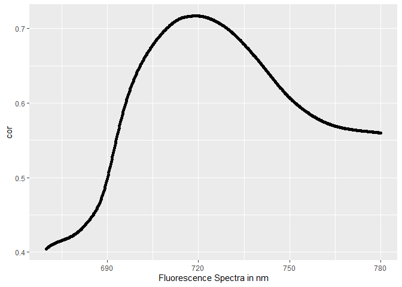<!-- -->

## **Changes in the the wavelegnt over time**

``` r
time_agg |> 
  tidyr::pivot_longer(
    cols = "669.98":"779.96",
    names_to = "wavelength",
    values_to = "Fluorescence") |> 
  ggplot2::ggplot(ggplot2::aes(x=as.numeric(wavelength), y=Fluorescence, color=DOYdayfrac)) +
  ggplot2::geom_point() +
  ggplot2::geom_line()+
  ggplot2::facet_wrap(~day)+
  ggplot2::xlab(label="Wavelength") 
```

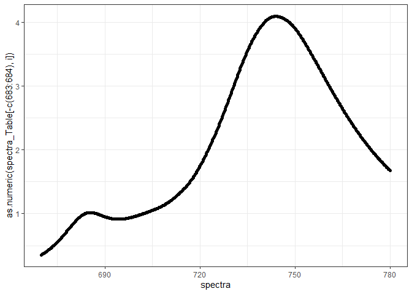<!-- -->

## **Regressions**

``` r
df_final_sub |> 
  ggplot2::ggplot(ggplot2::aes(x=GPP_DT_U95, y= Fint))+
  ggplot2::geom_jitter(ggplot2::aes(colour=as.factor(day)))+
  ggplot2::geom_smooth(method = "lm")+
  ggpubr::stat_regline_equation(ggplot2::aes(
  label =  paste(..eq.label.., ..rr.label.., sep = "*plain(\",\")~~")))
```

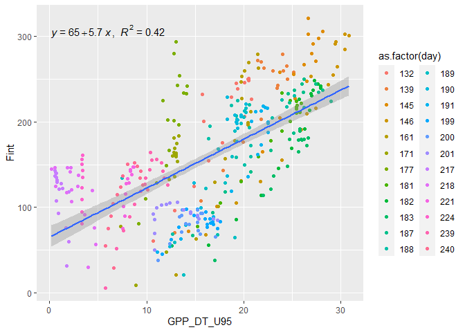<!-- -->

Controlling by the hours between 11:00 AM and 01:00 PM

``` r
df_final_sub |>
  dplyr::filter(Hr1 > 10 & Hr1 < 14) |> 
  ggplot2::ggplot(ggplot2::aes(x=GPP_DT_U95, y= Fint))+
  ggplot2::geom_jitter(ggplot2::aes(colour=as.factor(day)))+
  ggplot2::geom_smooth(method = "lm")+
  ggpubr::stat_regline_equation(ggplot2::aes(
  label =  paste(..eq.label.., ..rr.label.., sep = "*plain(\",\")~~")))
```

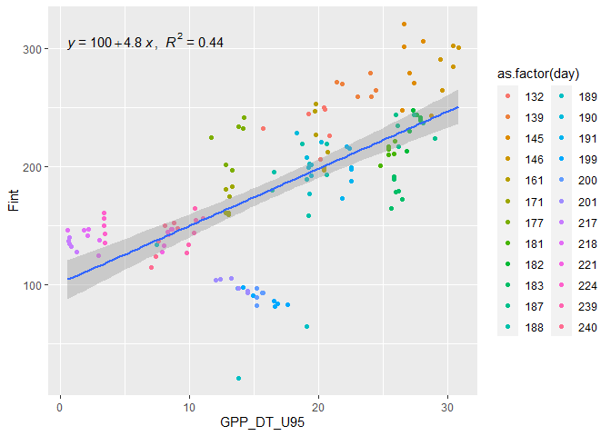<!-- -->

With the `780` wavelength

``` r
df_final_sub |> 
  ggplot2::ggplot(ggplot2::aes(x=GPP_DT_U95, y= `779.96`))+
  ggplot2::geom_jitter(ggplot2::aes(colour=as.factor(day)))+
  ggplot2::geom_smooth(method = "lm")+
  ggpubr::stat_regline_equation(ggplot2::aes(
  label =  paste(..eq.label.., ..rr.label.., sep = "*plain(\",\")~~")))
```

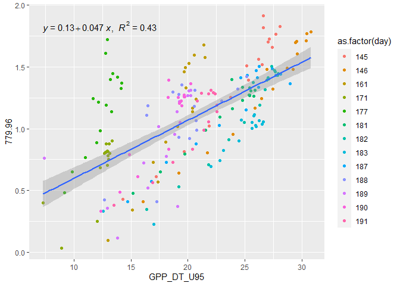<!-- -->

``` r
df_final_sub |>
  dplyr::filter(Hr1 > 10 & Hr1 < 14) |> 
  ggplot2::ggplot(ggplot2::aes(x=GPP_DT_U95, y= `779.96`))+
  ggplot2::geom_jitter(ggplot2::aes(colour=as.factor(day)))+
  ggplot2::geom_smooth(method = "lm")+
  ggpubr::stat_regline_equation(ggplot2::aes(
  label =  paste(..eq.label.., ..rr.label.., sep = "*plain(\",\")~~")))
```

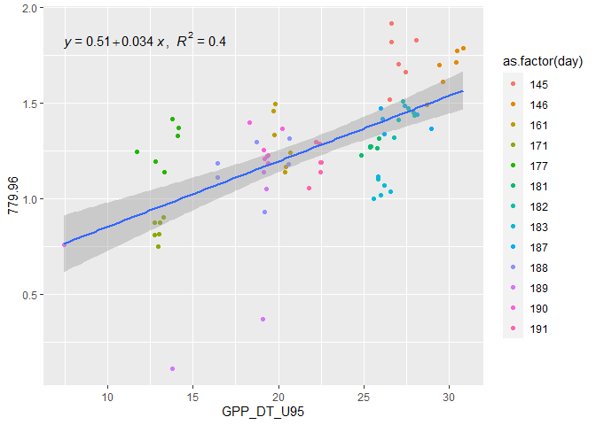<!-- -->

With the other two selected waves

``` r
df_final_sub |> 
  ggplot2::ggplot(ggplot2::aes(x=GPP_DT_U95, y= `740.02`))+
  ggplot2::geom_point()+
  ggplot2::geom_smooth(method = "lm")+
  ggpubr::stat_regline_equation(ggplot2::aes(
  label =  paste(..eq.label.., ..rr.label.., sep = "*plain(\",\")~~")))
```

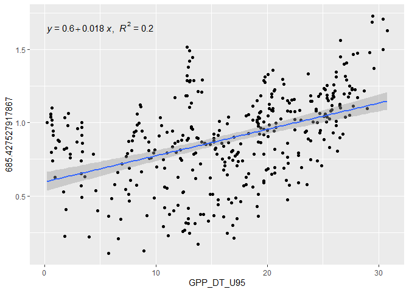<!-- -->

``` r
df_final_sub |> 
  ggplot2::ggplot(ggplot2::aes(x=GPP_DT_U95, y= `685.09`))+
  ggplot2::geom_point()+
  ggplot2::geom_smooth(method = "lm")+
  ggpubr::stat_regline_equation(ggplot2::aes(
  label =  paste(..eq.label.., ..rr.label.., sep = "*plain(\",\")~~")))
```

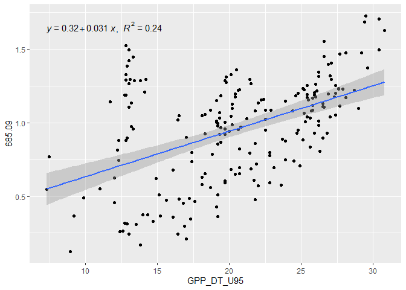<!-- -->

``` r
df_final_sub |> 
  ggplot2::ggplot(ggplot2::aes(x=GPP_DT_U95, y= Fint))+
  ggplot2::geom_point()+
  ggplot2::geom_smooth(method = "lm")+
  ggplot2::facet_wrap(~day, scales = "free")+
  ggplot2::theme_classic()+
  ggpubr::stat_regline_equation(ggplot2::aes(
  label =  paste(..rr.label..)))
```

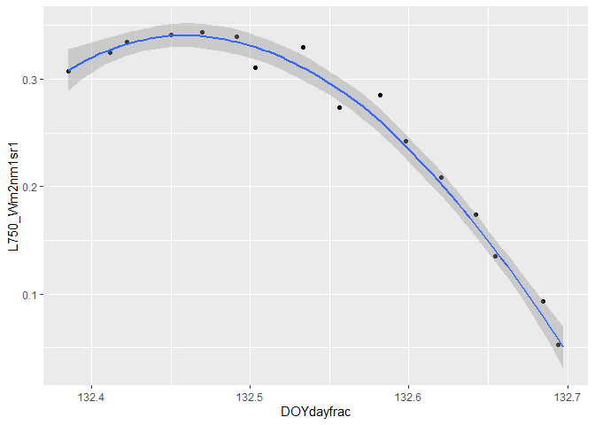<!-- -->

``` r
df_final_sub |> 
  ggplot2::ggplot(ggplot2::aes(x=GPP_DT_U95, y= `779.96`))+
  ggplot2::geom_point()+
  ggplot2::geom_smooth(method = "lm")+
  ggplot2::facet_wrap(~day, scales = "free")+
  ggplot2::theme_classic()+
  ggpubr::stat_regline_equation(ggplot2::aes(
  label =  paste(..rr.label..)))
```

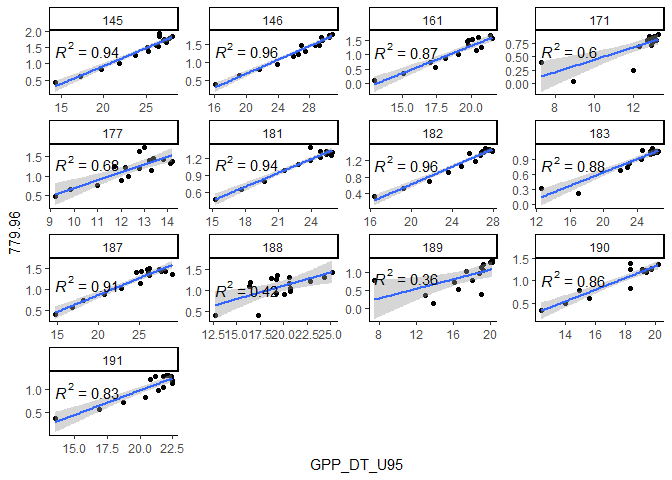<!-- -->

# **Clounds and reflectance**

Detection of clounds using the incoming radiance at 750 nm

``` r
for(i in c(145,146,161,171,177,181,182,183,187,188,189,190,191)){
  print(time_agg |>
          dplyr::filter(DOYdayfrac%/%1 == i) |>
          ggplot2::ggplot(ggplot2::aes(x=DOYdayfrac, y= L750_Wm2nm1sr1))+
          ggplot2::geom_jitter()+
          ggplot2::geom_smooth())
  }
```

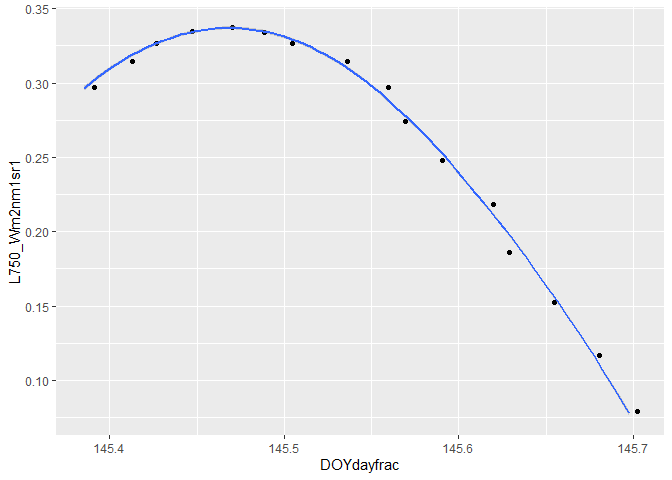<!-- -->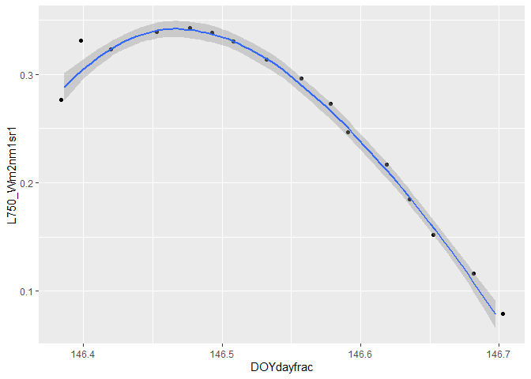<!-- -->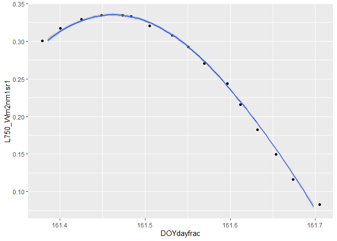<!-- -->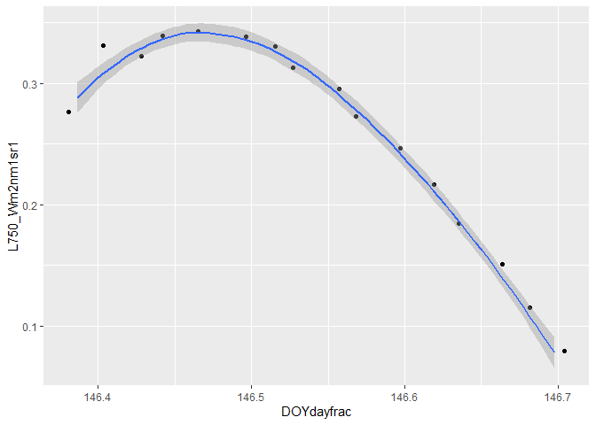<!-- -->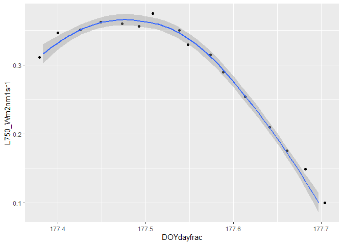<!-- -->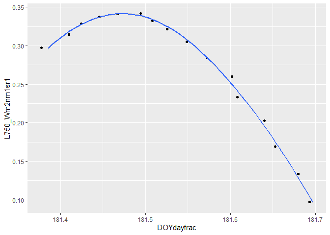<!-- --><!-- --><!-- -->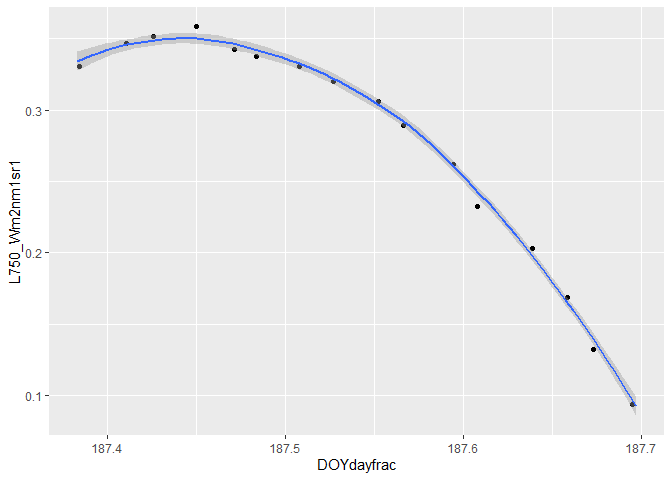<!-- -->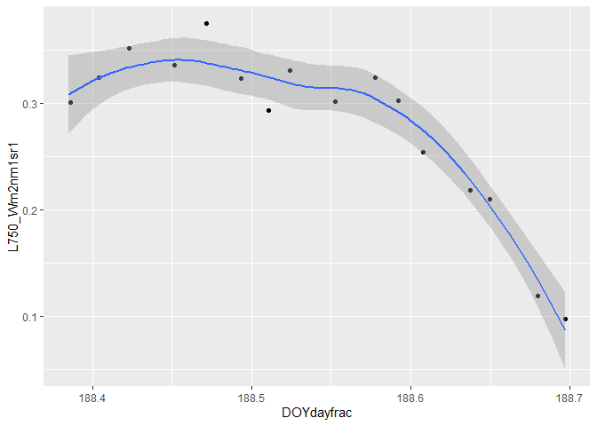<!-- -->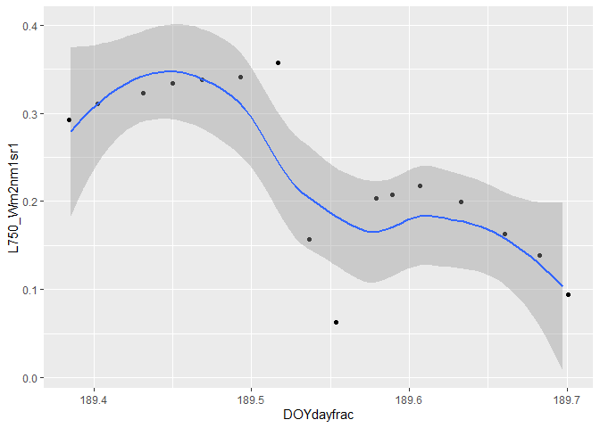<!-- -->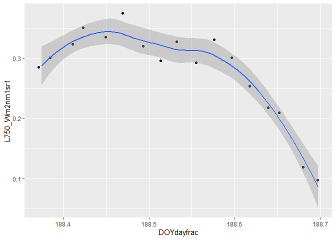<!-- -->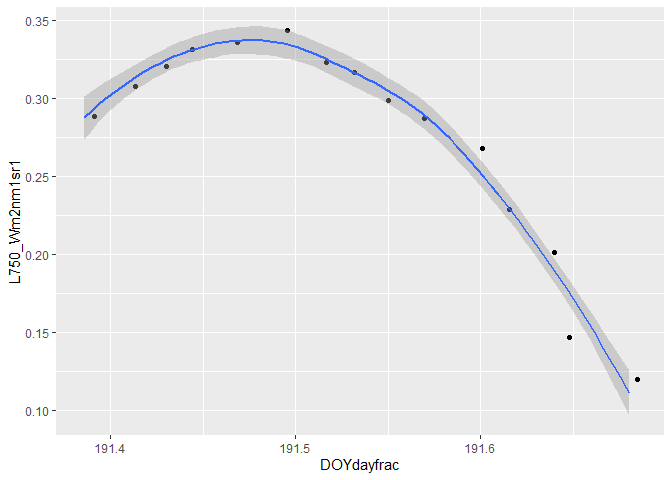<!-- -->

Here we are gonna see how the reflectance of the canopy are changing,
and for this we are gonna use the NDVI and NDVI red-edge

``` r
rfile <- list.files("data-raw/", pattern = "_R_")
rtab <- readr::read_rds(paste0("data-raw/",rfile))

rspec <- as.data.frame(t(rtab))
c_name <- rspec[1,]
colnames(rspec) <- c_name
rspec <- rspec[-1, ]
```

Using only the bands that are necessary

``` r
rnir <- rspec[c(616:682),]
rnir_spec <- as.numeric(rownames(rnir))
rnir <- cbind(rnir_spec,rnir)

rred <- rspec[c(1:49),]
rred_spec <- as.numeric(rownames(rred))
rred <- cbind(rred_spec,rred)

redge <- rspec[c(207:267),]
redge_spec <- as.numeric(rownames(redge))
redge <- cbind(redge_spec,redge)
```

doing the integral for these bands

``` r
rnir_result <- vector("list", length = ncol(rnir))
rred_result <- vector("list", length = ncol(rred))
redge_result <- vector("list", length = ncol(redge))

for (i in 1:(ncol(rnir))){
  int <- integral(rnir$rnir_spec, rnir[,i])
  rnir_result[[i]] <- integrate(int, min(rnir$rnir_spec), max(rnir$rnir_spec))
}

for(i in 1:length(rnir_result)){
  if(i==1){
    rnir_int <- rnir_result[[i]]$value
  }else{
    rnir_int_a <- rnir_result[[i]]$value
    rnir_int <- rbind(rnir_int,rnir_int_a)
    rnir_int <- as.data.frame(rnir_int)
  }
}

rnir_int <- rnir_int[-1,]
rnir_int <- as.data.frame(rnir_int)

for (i in 1:(ncol(rred))){
  int <- integral(rred$rred_spec, rred[,i])
  rred_result[[i]] <- integrate(int, min(rred$rred_spec), max(rred$rred_spec))
}

for(i in 1:length(rred_result)){
  if(i==1){
    rred_int <- rred_result[[i]]$value
  }else{
    rred_int_a <- rred_result[[i]]$value
    rred_int <- rbind(rred_int,rred_int_a)
    rred_int <- as.data.frame(rred_int)
  }
}
rred_int <- rred_int[-1,]
rred_int <- as.data.frame(rred_int)

for (i in 1:(ncol(redge))){
  int <- integral(redge$redge_spec, redge[,i])
  redge_result[[i]] <- integrate(int, min(redge$redge_spec), max(redge$redge_spec))
}

for(i in 1:length(redge_result)){
  if(i==1){
    redge_int <- redge_result[[i]]$value
  }else{
    redge_int_a <- redge_result[[i]]$value
    redge_int <- rbind(redge_int,redge_int_a)
    redge_int <- as.data.frame(redge_int)
  }
}

redge_int <- redge_int[-1,]
redge_int <- as.data.frame(redge_int)
```

Now the formula for the both ndvi

``` r
ndvi <- (rnir_int - rred_int)/(rnir_int+rred_int)
colnames(ndvi) <- "NDVI"

ndvi_r <- (rnir_int- redge_int)/(rnir_int + redge_int)
colnames(ndvi_r) <- "NDVI Red"

rtab <- cbind(rtab,ndvi,ndvi_r)

mean_ndvi <- rtab |>
  dplyr::mutate(day = DOY%/%1) |>
  dplyr::group_by(day) |>
  dplyr::summarise(ndvi = mean(NDVI))

mean_ndvi_r <- rtab |>
  dplyr::mutate(day = DOY%/%1) |>
  dplyr::group_by(day) |>
  dplyr::summarise(ndvi_r = mean(`NDVI Red`))
```

We also are gonna need the NDVI aggregated, so now we are gonna do the
same process with this data

``` r
rtab <- cbind(ind_file,rtab)
rtab <- rtab |>
  dplyr::filter(lubridate::hour(rtab$UTC_datetime) > 8)

ndvi_agg <- aggregate(x = rtab,
                      by = list(cut(as.POSIXct(rtab$UTC_datetime,tz = "UTC"),
                                    timetoagg)), FUN = mean)

ndvi_agg <- ndvi_agg |> dplyr::mutate(day = DOY%/%1,
                                      Hr1 = lubridate::hour(as.character(Group.1)),
                                      Mn1 = lubridate::minute(as.character(Group.1)))

ndvi_agg <- ndvi_agg[,-7] 

comp_ndvi_gpp <- dplyr::semi_join(ndvi_agg,gpp_table)
```

    ## Joining, by = c("day", "Hr1", "Mn1")

Calculatin the NIRv for latter calculate the `aPAR`

``` r
t_rnir <- data.frame(t(rnir))
names(t_rnir) <- round(as.numeric(t_rnir[1,]),2)
t_rnir <- t_rnir[-1,]

t_rnir <- cbind(ind_file,t_rnir)

t_rnir <- t_rnir |>
  dplyr::filter(lubridate::hour(UTC_datetime) > 8 & DOYdayfrac >= 144 & DOYdayfrac <=193)

min_int<-"30 min"
sttime <- t_rnir$UTC_datetime[1]
endtime <- t_rnir$UTC_datetime[8344]

timetoagg<-seq.POSIXt(from = as.POSIXct(sttime,tz = "UTC"),
                      to = as.POSIXct(endtime,tz = "UTC"),
                      by = min_int)

nir_agg <- aggregate(x = t_rnir,
                      by = list(cut(as.POSIXct(t_rnir$UTC_datetime,tz = "UTC"),
                                    timetoagg)), FUN = mean)
nir_agg <- nir_agg |>
  dplyr::select(
    Group.1,
    `775`
  )
names(nir_agg)[2] <- "R775"

nir_agg <- dplyr::semi_join(nir_agg,comp_ndvi_gpp)
```

    ## Joining, by = "Group.1"

And Finaly the plots to see the changes

## **NDVI**

``` r
mean_ndvi |>
  ggplot2::ggplot(ggplot2::aes(x=day, y=ndvi))+
  ggplot2::geom_jitter()+
  ggplot2::geom_point(data = subset(mean_ndvi, ndvi< 0.9),
                      ggplot2::aes(x=day,y=ndvi)
                      , colour="red")
```

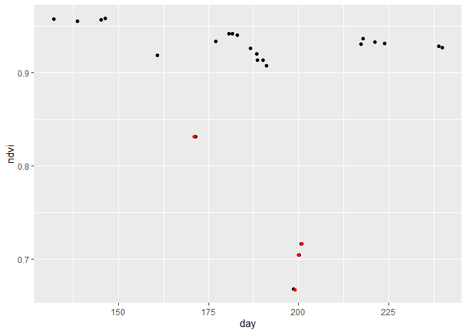<!-- -->

## **NDVI Red Edge**

``` r
mean_ndvi_r |>
  ggplot2::ggplot(ggplot2::aes(x=day, y=ndvi_r))+
  ggplot2::geom_jitter()+
  ggplot2::geom_point(data = subset(mean_ndvi_r, ndvi_r< 0.59),
                      ggplot2::aes(x=day,y=ndvi_r)
                      , colour="red")
```

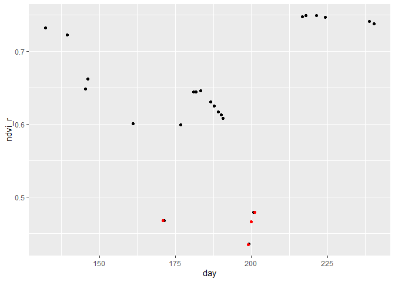<!-- -->

# **Interpreting**

the following figure show to us, the days in the data-set that have
problems and the most provable cause, this days we are gonna exclud for
our analyses.

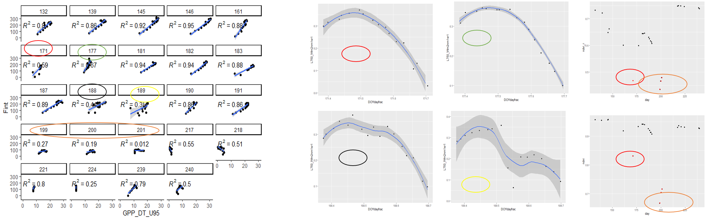

``` r
NDVI <- comp_ndvi_gpp$NDVI
NDVI_R <- comp_ndvi_gpp$`NDVI Red`
NIR = NDVI*nir_agg$R775
ndvi_df <- data.frame(NDVI,NDVI_R, NIR)
df_final_sub <- cbind(df_final_sub,ndvi_df)

df_tab <- df_final_sub |>
  dplyr::filter(day != 171 & day !=177 & day !=188 & day != 189
                & day !=199 & day != 200 & day != 201)


df_tab <- df_tab |>
  dplyr::mutate(
    k1=584*sin(circular::rad(SZA)) - 88,
    k2= 3.55424 - 1.15937*cos(circular::rad(SZA)),
    aPAR= k1*sin(k2*NIR),
    Fy= Fint/aPAR,
    LUE=GPP_DT_U95/aPAR
  )

readr::write_rds(df_tab,"data/base.rds")
```
